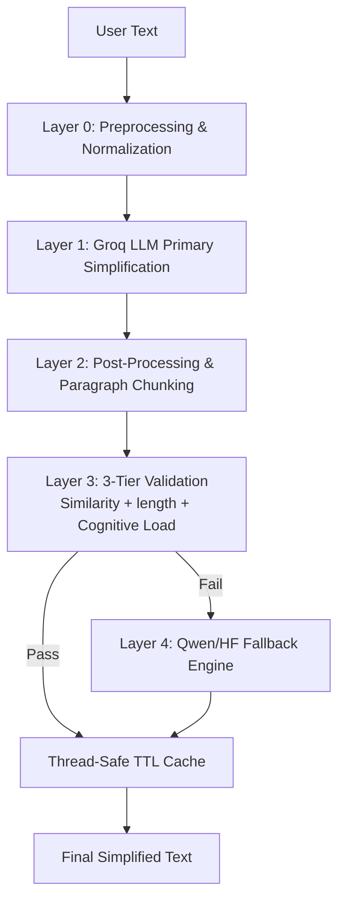

# 🧠 NeuroRead: AI Adaptive Reading & Accessibility

**NeuroRead** is a production-grade AI accessibility platform designed to empower readers with dyslexia and ADHD. It combines state-of-the-art LLM simplification with an adaptive learning engine to transform cognitively demanding content into accessible, natural, and meaningful language.

---

## 🚀 Key Impressive Features

### 1. **SSV2: Smart Simplifier V2 (LLM-First Architecture)**
Unlike traditional word-swapping tools, **SSV2** uses a multi-layered LLM pipeline (Groq + Llama-3.3-70B) to rewrite complex text. It prioritizes semantic integrity while aggressively reducing cognitive load.
*   **ACM (Adaptive Cognitive Modeling)**: Real-time analysis of "Cognitive Intensity" using readability indices and sentence-transformer embeddings.
*   **Meaning-First Validation**: A 0.90 semantic similarity threshold ensures that simplification never leads to information loss.

### 2. **VFC: Visual Flow Control**
Designed specifically for the dyslexic eye, **VFC** implements:
*   **OpenDyslexic Integration**: Specialized high-contrast typography.
*   **Dynamic Spacing**: Automated paragraph chunking (`\n\n` formatting) to prevent visual crowding and "text-swimming."

### 3. **EPD: Error Pattern Detection (Learning Mode)**
For younger learners, the system tracks specific phonological bottlenecks (e.g., *b/d* or *p/q* confusion). 
*   **Adaptive Content Engine**: Dynamically scales exercise difficulty and content focus based on real-time error rates.

### 4. **Multimodal Support**
*   **Reading Voice (TTS)**: High-quality text-to-speech for auditory reinforcement.
*   **Accessibility Dashboard**: Visualizes long-term progress in reading speed, comprehension, and XP-based milestones.

---

## 🏗️ System Architecture & Flow

### **AI Simplification Pipeline (V2)**


---

## 📂 Project Structure

### **Backend (FastAPI)**
The engine room, built for high-concurrency and low-latency ML inference.
*   `app/services/simplification_engine.py`: The core V2 pipeline logic.
*   `app/services/learning/`: Adaptive logic for error patterns and content scaling.
*   `app/routes/`: RESTful endpoints for Assistive and Learning modes.
*   `app/models/`: Database schemas for user profiles and progress tracking.

### **Frontend (React + Vite)**
A premium, "Moss & Clay" themed interface optimized for focus and accessibility.
*   `src/components/SimplifierModal.jsx`: The main interface for SSV2.
*   `src/components/learning/`: Interactive modules for Phonics and Spelling.
*   `src/components/ProgressDashboard.tsx`: Data visualization for cognitive metrics.
*   `src/components/AssistiveMode.jsx`: Unified accessibility toggle system.

---

## 🛠️ Technology Stack

| Layer | Technology |
| :--- | :--- |
| **Inference** | Groq (Llama-3.3-70B-Versatile), HuggingFace (Qwen-72B) |
| **Semantic AI** | `sentence-transformers` (all-MiniLM-L6-v2) |
| **Backend** | Python 3.10+, FastAPI, SQLAlchemy |
| **Database** | PostgreSQL |
| **Frontend** | React 19, Vite, TypeScript, Tailwind CSS |
| **Animations** | Framer Motion |

---

## 📦 Quick Start

### **1. Backend Setup**
```bash
cd backend
pip install -r requirements.txt
# Set your GROQ_API_KEY in .env
python -m uvicorn app.main:app --reload
```

### **2. Frontend Setup**
```bash
cd ai-accessibility-assistant-frontend-main
npm install
npm run dev
```

---

## 🧠 Final Objective
NeuroRead targets the **linguistic quality gap**. By moving away from "robotic" word-swapping and toward **natural human tone**, we provide a reading experience that is not just easier, but more enjoyable for neurodivergent minds.

**"Reading, Reimagined."**
